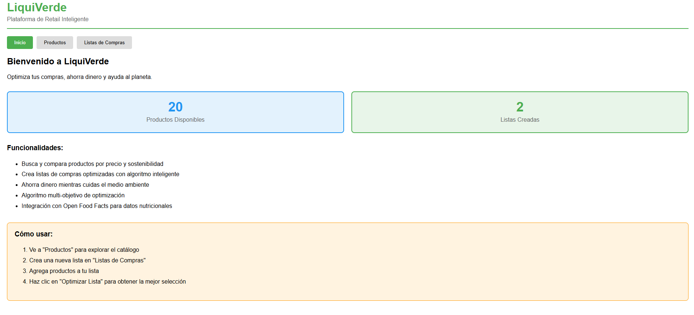
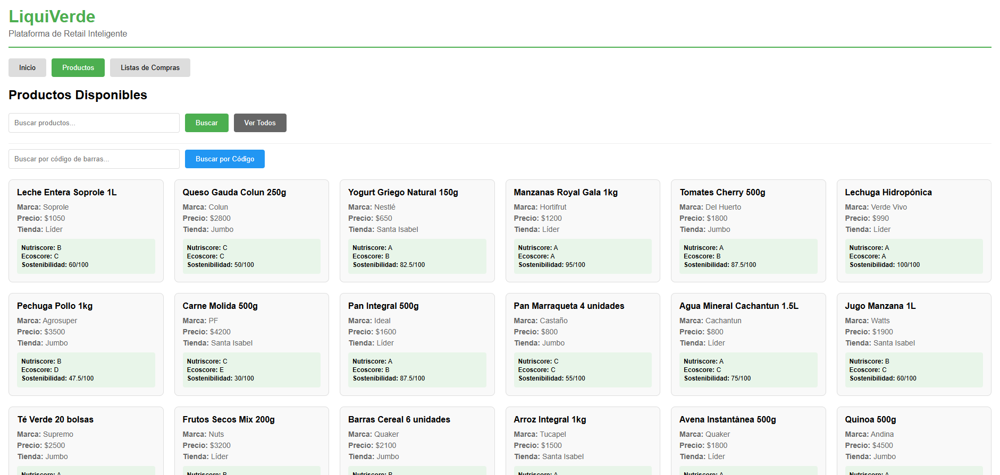
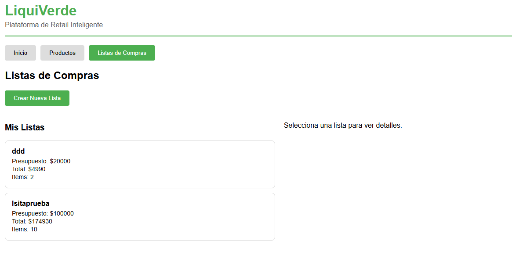
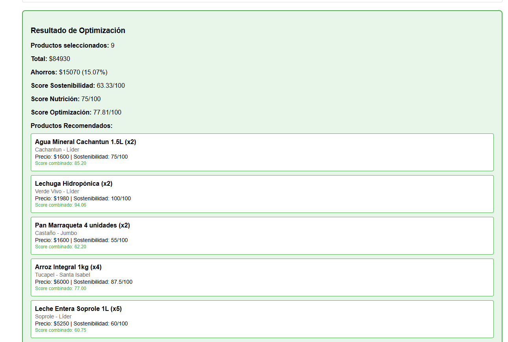
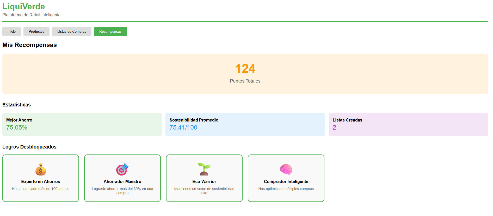
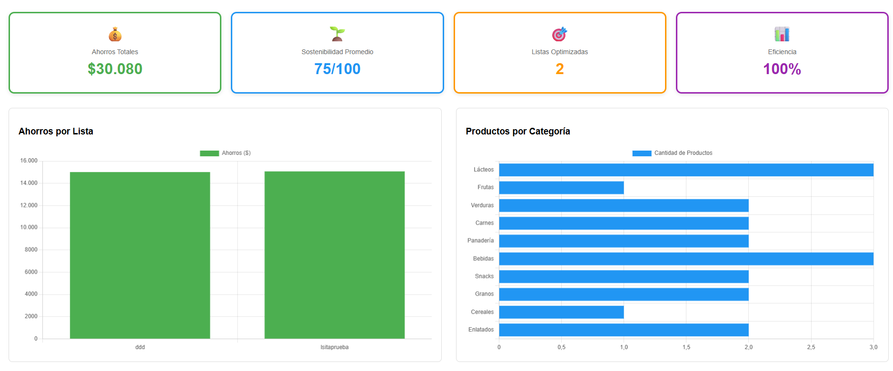
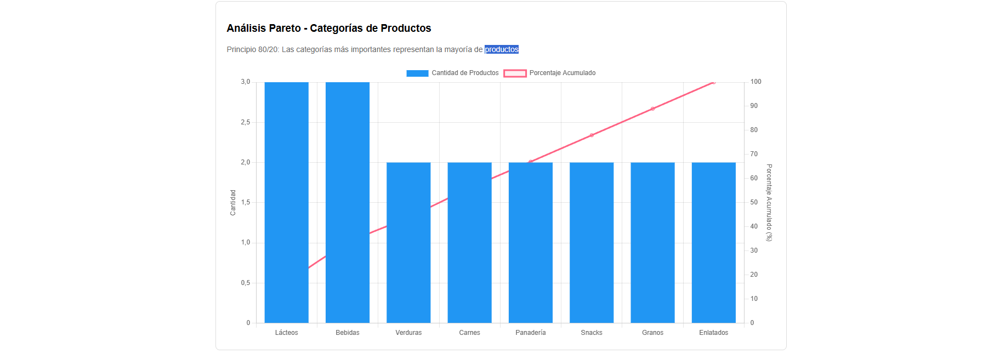

# LiquiVerde - Plataforma de Retail Inteligente

Plataforma full-stack que ayuda a los consumidores a ahorrar dinero mientras toman decisiones de compra sostenibles,
optimizando presupuesto e impacto ambiental.

## Caracteristicas Principales
- Sistema de análisis de productos con scoring de sostenibilidad
- Optimización de listas de compras mediante algoritmo de mochila Multi-Objetivo
- Búsqueda de productos por nombre o codigo de barras
- Integración con Open Food Facts Api para datos nutricionales
- Cálculo automatico de ahorros e impacto ambiental

## Stack tecnológico

### Backend
- Python 3.11
- FastAPi
- PostgreSQL 15
- SQLAlchemy
- Docker

### Frontend
- React 18
- Vite
- Axios

### APIs Externas
- Open Food Facts API

## Requisitos Previos
- Docker Desktop instalado y en ejecucion
- Git

## Instalacion y Ejecución

### Clonar el repositorio
```bash
git clone https://github.com/tuusuario/liquiverde.git
cd liquiverde
```

### Levantar los servicios con Docker
```bash
docker-compose up --build
```

Esto levantará:
- Backend en `http://localhost:8000`
- Frontend en `http://localhost:5173`
- PostgresSql en puerto `5432`

### Acceder a la aplicacion
- **Frontend:** http://localhost:5173
- **Backend:** http://localhost:8000
- **Documentación API (Swagger):** http://localhost:8000/docs

### Poblar la base de datos con datos de ejemplo
```bash
docker-compose exec backend python seed_data.py
```
Esto creará 20 productos de ejemplo en 8 categorías diferentes

## Comandos Útiles

### Iniciar el Proyecto

**Backend + Base de Datos (Docker):**
```bash
docker-compose up
```

**Frontend (Local - en otra terminal):**
```bash
cd frontend
npm run dev
```

### Iniciar y reconstruir contenedores
```bash
docker-compose up --build
```

### Detener el Proyecto

**Docker:**
```bash
docker-compose down
```

**Frontend local:** `Ctrl + C` en la terminal donde corre

### Ver logs en tiempo real
```bash
docker-compose logs -f backend
```

### Ejecutar seed de datos
```bash
docker-compose exec backend python seed_data.py
```

### Acceder a la base de datos (PostgreSQL)
```bash
docker-compose exec db psql -U admin -d liquiverde
```

### Limpiar contenedores y volúmenes
```bash
docker-compose down -v
```

### Reiniciar servicios
```bash
docker-compose restart backend
```

## Desarrollo Local (sin Docker)

### Backend
```bash
cd backend
pip install -r requirements.txt
uvicorn main:app --reload
```

### Frontend
```bash
cd frontend
npm install
npm run dev
```

## Algoritmos Implementados

### 1. Sistema de Scoring de Sostenibilidad

Calcula un puntaje de 0 - 100 para cada producto considerando múltiples factores.

**Componentes del Score**

- **Nutriscore (40%):** Calidad nutricional del producto (A=100, B= 75, C=50, D=25, E=0)
- **Ecoscore (30%):** Impacto ambiental (A=100, B=75, C=50, D=25, E=0)
- **Precio (20%):** Accesibilidad economica (precios bajos = mayor puntaje)
- **Certificacion Organica (10%):** Bonus por productos organicos

### Fórmulas

**Calculo de ahorros**

Definiciones:
- Presupuesto (budget): monto máximo disponible
- Total seleccionado (total_price): suma de los precios totales de los productos elegidos (precio × cantidad)

Fórmulas:
- Ahorro: savings = budget - total_price
- Porcentaje de ahorro: savings_percentage = (savings / budget) × 100

Ejemplo:
- Presupuesto: $30.000
- Selección: 2 Lechugas ($990 c/u) + 5 Aguas ($800 c/u)
- Total seleccionado: (2 × 990) + (5 × 800) = 1.980 + 4.000 = $5.980
- Ahorro: 30.000 - 5.980 = $24.020
- Porcentaje: (24.020 / 30.000) × 100 ≈ 80,07%

**Score combinado del algoritmo de Optimizacion***
Variables por producto:
- price: precio TOTAL del ítem (precio unitario × cantidad)
- sustainability_score: puntaje de sostenibilidad (0–100)
- Nutriscore: letra nutricional (A, B, C, D, E)
- max_price: 10.000 (tope para normalización de precio)
- Pesos por defecto: w_price = 0.3, w_sust = 0.4, w_nut = 0.3

Conversión nutricional:
- A=100, B=75, C=50, D=25, E=0

Normalización de precio:
- price_score = (1 - (price / max_price)) × 100  si price < max_price
- price_score = 0                               si price ≥ max_price

Score combinado:
- combined = (price_score × w_price) + (sustainability_score × w_sust) + (nutrition_score × w_nut)

Relación valor/precio para ordenamiento:
- value_ratio = combined / price

Selección:
- Se ordenan los productos por value_ratio (descendente) y se agregan mientras no se exceda el budget.


### 2. Algoritmo de Mochila Multi-Objetivo

Optimiza la seleccion de productos de una lista considerando presupuesto y múltiples objetivos.

**Restricción principal:**
- Presupuesto maximo (hard constraint)

**Objetivos a maximizar:**
- Valor nutricional
- Sostenibilidad ambiental
- Relacion calidad-precio

**Proceso del algoritmo:**

1. Calcula un score combinado para cada producto usando pesos configurables
2. Calcula la relacion valor/precio para cada producto
3. Ordena productos por mejor relacion valor/precio (greedy)
4. Selecciona productos mientras no exceda el presupuesto

**Implementación:** `backend/services/knapsack_service.py`

**Ejemplo de optimización:**
- Entrada: 10 productos, presupuesto $30.000
- Salida: 7 productos seleccionados, total $19.700, Ahorro $10.300 (34%)

## Estructura del Proyecto
```
liquiverde/
├── backend/
│   ├── database/
│   │   ├── connection.py          # Configuración de base de datos
│   │   └── init_db.py              # Inicialización de tablas
│   ├── models/
│   │   ├── product.py              # Modelo de productos
│   │   ├── shopping_list.py        # Modelo de listas
│   │   └── shopping_item.py        # Modelo de items
│   ├── routes/
│   │   ├── products.py             # Endpoints de productos
│   │   ├── shopping_lists.py       # Endpoints de listas
│   │   ├── search.py               # Endpoints de búsqueda
│   │   └── optimization.py         # Endpoints de optimización
│   ├── services/
│   │   ├── scoring_service.py      # Lógica de scoring
│   │   ├── knapsack_service.py     # Algoritmo de mochila
│   │   └── openfoodfacts_service.py # Cliente API externa
│   ├── tests/
│   │   ├── test_knapsack_service.py      # Test para lógica mochila multi
│   │   ├── test_endpoints.py     # test de endpoint API
│   │   └── test_scoring_service.py # Test de score 
│   ├── schemas/
│   │   ├── product_schema.py       # Validación de productos
│   │   └── shopping_list_schema.py # Validación de listas
│   ├── main.py                     # Aplicación FastAPI
│   ├── seed_data.py                # Datos de ejemplo
│   ├── requirements.txt            # Dependencias Python
│   └── Dockerfile                  # Imagen Docker backend
├── frontend/
│   ├── src/
│   │   ├── api.js                  # Cliente API
│   │   ├── App.jsx                 # Componente principal
│   │   ├── Products.jsx            # Vista de productos
│   │   ├── ShoppingLists.jsx       # Vista de listas
│   │   └── main.jsx                # Entry point
│   ├── package.json                # Dependencias Node
│   └── Dockerfile                  # Imagen Docker frontend
├── docker-compose.yml              # Orquestación de servicios
└── README.md                       # Este archivo
```

## API Endpoints

### Productos
- `GET /products/` - Listar todos los productos
- `GET /products/{id}` - Obtener productos por ID
- `POST /products/` - crear nuevo producto

### Busqueda
- `GET /search/barcode/{barcode}` - Buscar producto por codigo de barras en open food facts
- `GET /search/products?query={text}` - Buscar productos por nombre

### Lista de Compras
- `GET /shopping-lists/` - Listar todas las listas
- `GET /shopping-lists/{id}` - Obtener lista por ID
- `POST /shopping-lists/` - Crear nueva lista
- `POST /shopping-lists/{id}/items` - Agregar producto a la lista

### Optimización
- `POST /optimization/optimize` - Optimizar seleccion de productos
    -Body: `{ product_ids: [1,2,3], budget:5000 }`
- `POST /optimization/optimize-list/{id}` - Optimizar lista existente

## Uso de IA Generativa

Este proyecto fue desarrollado con asistencia de **Claude(Anthropic)** como herramienta de apoyo al desarrollo.

### Asistencia proporcionada por IA:

**Implementación de Algoritmo:**
- Codigo base del algoritmo de mochila Multi-objetivo
- Implementación del sistema de scoring de sostenibilidad
- Optimización de queries y lógica de negocio

**Desarrollo de codigo:**
- Scaffolding de rutas y endpoints de FastApi
- Componentes base de React(products, shoppingLists)
- Integración con Open Food Facts API
- Generación de datos de prueba (SEED)

**dDebugging y Resolución de Problemas:**
- Corrección de errores de sintaxis
- Solución de problemas de configuración Docker
- Ajustes en validaciones y manejo de errores

### Contribucion del desarrollador:

**Arquitectura y Estructura:**
- Configuración inicial de docker compose
- Definicion de modelos de base de datos y relaciones
- Diseño de la estructura de carpeta del proyecto (backend/frontend)

**Decisiones Técnicas:**
- Selección del stack tecnológico (React + FastApi + PostgreSQL)
- Elección de funcionalidades a implementar
- Priorización entre features obligatorias y bonus

**Validacion y testing:**
- Prueba manual de todos los endpoints de la API
- Validacion de funcionalidad en el frontend
- Testing de optimizacion con diferentes presupuestos y productos

** Comprensión y Adaptacion:**
- Análisis y comprension completa de cada algoritmo implementado
- Ajustes en la lógica de negocio según necesidades
- Corrección de errores identificados durante el testing
- Integración coherente de todos los componentes

**Documentacion**
- Estructura y contenido de este README
- Decisiones sobre que documentar y como presentarlo

## Funcionalidades Implementadas

### Obligatorias
- Sistema de análisis de productos y sostenibilidad
- Optimización de listas de compras multi-criterio
- Algoritmo de Mochila Multi-objetivo
- sistema de Scoring de Sostenibilidad
- Escáner de productos (busqueda por codigo de barras)
- Generador de listas de compras optimizadas

### Bonus implementadas
- Cálculo de ahorros de impacto ambiental
- Docker + docker compose
- **PWA (Progressive Web App)** - Aplicación instalable
- **Sistema de Recompensas** - Puntos y badges por compras sostenibles
- **Dashboard profesional** - KPI Cards y análisis Pareto
- Dashboard de estadísticas
- Busqueda por nombre de producto
- Integración con Open Food Facts API

## Notas de Implementación

- La base de datos se inicializa automáticamente al levantar los contenedores
- El sistema calcula automáticamente el sustainability_score al crear productos
- La optimización usa pesos configurables (por defecto: 30%, 40% sostenibilidad, 30% nutricion)
- Los datos de Open Food Facts pueden no tener todos los campos completos

## Solución de Problemas

### Windows

**Error: Puerto 5432 ya en uso**
```powershell
# Encontrar proceso usando puerto 5432
netstat -ano | findstr :5432
# Matar proceso (reemplaza PID con el número que obtuviste)
taskkill /PID  /F
```

**Error: Puerto 8000 ya en uso**
```powershell
netstat -ano | findstr :8000
taskkill /PID  /F
```

**Error: Puerto 5173 ya en uso (Frontend)**
```powershell
netstat -ano | findstr :5173
taskkill /PID  /F
```

### Linux/Mac

**Error: Puerto ya en uso**
```bash
# Encontrar y matar proceso
lsof -ti:8000 | xargs kill -9
lsof -ti:5173 | xargs kill -9
```

**Frontend no conecta con Backend**
- Verificar que backend esté corriendo en `http://localhost:8000`
- Verificar que frontend esté corriendo en `http://localhost:5173`
- Revisar CORS en `backend/main.py`

**Base de datos vacía**
```bash
docker-compose exec backend python seed_data.py
```

**Docker no inicia**
- Verificar que Docker Desktop esté corriendo
- Reiniciar Docker Desktop

## Capturas de pantalla

### Dashboard Principal


### Catálogo de Productos


### Listas de Compras


### Optimización de Lista


### Sistema de recompensa


### KPI's, Métricas y Análisis



### Grafico Pareto


## Progressive Web App (PWA)

LiquiVerde es una aplicación web progresiva que puede instalarse en dispositivos móviles y de escritorio.

**Características:**
- Instalable desde el navegador
- Funciona offline con Service Worker
- Experiencia de app nativa
- Íconos personalizados

**Para instalar:** Abre la aplicación en tu navegador y busca el ícono de instalación en la barra de direcciones.


## Autor

Desarrollado como desafío técnico para Grupo Lagos - LiquiVerde

**Tiempo de desarrollo:** 24 horas
**Fecha:** Noviembre 2025